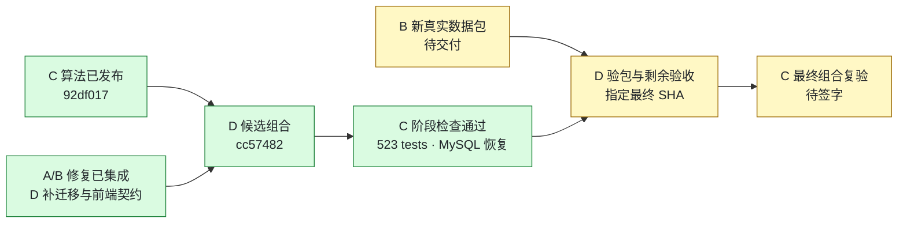

# C 项目进度看板

更新：2026-09-16。维护人：C。正式分支：`feature/v2-c-backtest-params`。**[PR #10](https://github.com/27ye/ai-quant-platform/pull/10) 为唯一最终集成；[PR #12](https://github.com/27ye/ai-quant-platform/pull/12) 保留 C 来源/审阅记录，不另行合并 main。**

**当前：D 候选组合 cc57482 的 C 阶段检查通过；等待新真实数据包、D 完成剩余关口并指定最终 SHA，随后做 C 最终签字。**

## 阶段视图

## 当前状态与责任人

| 事项 | 负责人 | 当前状态 | 证据 / 下一步 |
|---|---|---|---|
| 参数化、窗口、V1 默认兼容 | C | ✅ 核心保持 | D 的 12 文件与 C 92df017 Git blob 一致 |
| 候选组合全量测试 | C 复核 D | ✅ cc57482 通过 | 523 passed、compileall、7 项离线 C/AI 兼容检查 |
| v8 中断恢复与精确文本保护 | D/B，C 复验 | ✅ cc57482 通过 | MySQL 8.0.31：故障版本仍7，重试补齐旧9条，exact=false，新文本与重复迁移不变 |
| 搜索刷新失败后仍可用旧目录 | B，C 复验 | ✅ 已进入候选 | B25c 原7项 API 通过；D 本轮全量测试覆盖；真实浏览器成功搜索仍由 D 收尾 |
| 50006 / C detail / 哈希路径 / AI404 | D 实现，C 核对 | ✅ 当前源码对齐 | 本轮8项静态核对；不再列成 A 未提交；两处哈希注释可随文档收尾 |
| 新记录完整 MySQL 九组与列表 | B/C | ✅ 原 B9a1 隔离版本通过；⏳ 最终 SHA 待复验 | [原证据](evidence/c-followup-20260916/mysql-v8.json)，不转签新包/新 SHA |
| 新独立真实数据包 | B，D/C 验证 | 🟠 待交付 | B ab774a6 回复仍待导出；600519 9/15 旧包差异未以新批次关闭 |
| V1→v8、真实 LLM、部分页面 | D | 📋 D 已报告通过 | 见 PR #10；C 本轮未重新执行这些真实环境项目 |
| 剩余浏览器/首轮自动回测失败说明/CI | D | 🟠 待收尾 | 以 PR #10 门槛为准；无状态不等于 CI 通过 |
| 最终组合验收结论 | C | ⏳ 等新包与最终 SHA | 按[新阶段计划](C_V2_D_PLAN_ALIGNMENT_20260916.md)复验后再签 |

✅ 仅表示写明范围、版本的完成；📋 表示成员报告；🟠/⏳ 表示待办/前置依赖。不用估算百分比代替验收。

## 版本与证据入口

| 对象 | 完整 SHA |
|---|---|
| 本轮 D 候选 | `cc574827c6c08d2336336a48d9f7a09e9582c60a` |
| C 核心 | `92df017404126e9af920e1ad82e4a136d813f8d1` |
| D 声明的 C 来源 | `1d9cae17070dc7fe06a7c916ef8a0849e6790660`；后续 C 提交只补契约、进度与证据 |
| D 声明的 A / B | `010841099b20b500ed322b15cec32d9e7add97cd` / `25c11aa7b55d67fa5f77b3c603ca84b5369dc48e` |
| B 后续迁移修复 | `ab774a6591f2e9b5b25b2feee733c4c6c83b9be1`；与 D v8 执行 AST 相同，合并安排由 D 决定 |

- [最新 D 计划调整与候选复核](C_V2_D_PLAN_ALIGNMENT_20260916.md) / [机器可读证据](evidence/c-dplan-20260916/summary.json)
- [B25c 搜索复验](C_V2_B25C_REVIEW_20260916.md) / [B9a1 MySQL 与 A 定向复验](C_V2_FOLLOWUP_REVIEW_20260916.md)
- [旧 D15315 复核](C_V2_COMBINED_15315_REVIEW_20260916.md)：保留当时发现；不当作新候选的待修清单。

本轮不修改算法和其他成员生产代码；未把合成/SQLite 检查、植入的迁移夹具或 D 的真实环境报告写成新真实数据包验收。后续每次结论绑定实际最终 SHA。

## C 后续同步约定

按 2026-09-16 用户的协作要求执行，适用于 C 的后续工作：

1. 每个可审阅的小阶段完成后，在**同一轮工作中**更新本页的事项、负责人、状态、SHA、证据和下一步。
2. 有 C 代码/测试改动时，完成相应检查后提交并推送 `feature/v2-c-backtest-params`；只有复验/协调进展时，也提交 C 的进度文档与可共享证据，不能只保留在本机或聊天中。
3. 推送后核对本地 HEAD、远端分支与 PR #12 head SHA 一致；更新 PR 说明，在相关 Issue 留一条简明进度入口。失败或尚未验证的事项明确标注，不写成“已通过”。
4. PR 说明展示当前结论，历史报告保留原 SHA 与当时结果；新发现单独列项，已关闭项不反复列为待修。
5. 只提交 C 负责的文件及 C 验收记录；A/B 修复由对应成员提交，D 负责集成。推送进度不等于合并 PR，也不将其他成员的代码复制到 C 正式分支。
6. 若推送失败，明确报告“仅本地、尚未同步”和具体原因；修复后再次核对远端。可共享证据排除密钥、连接串、个人绝对路径和临时数据库标识。

本页随实际工作更新，不是后台自动监控。组员查看本页或 PR #12，即可了解 C 最近一次已核实的进度。
