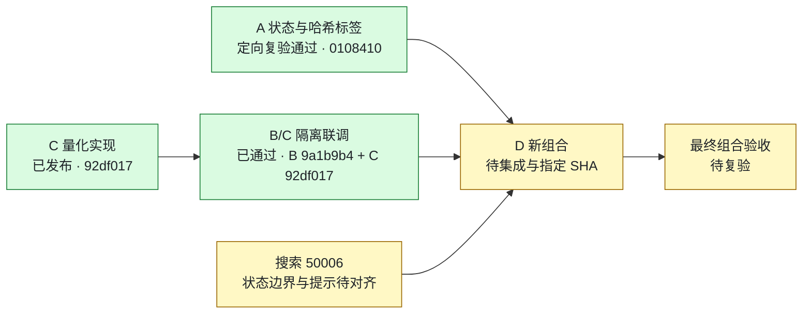

# C 项目进度看板

更新：2026-09-16。维护人：C。正式分支：`feature/v2-c-backtest-params`；审阅入口：[PR #12](https://github.com/27ye/ai-quant-platform/pull/12)。

**当前：C 量化实现已发布，B/C 指定版本联调已通过；等待 D 集成新版本后完成最终验收。** 下表的“通过”只绑定被测 SHA，不表示这些修复已经进入 D 分支。

## 阶段视图

## 当前状态与责任人

| 事项 | 负责人 | 状态 | 被测版本 / 证据 | 下一步 |
|---|---|---|---|---|
| V2 参数化与窗口回测，V1 默认兼容 | C | ✅ 已发布 | 核心 `92df017`；[原组合复核](C_V2_COMBINED_15315_REVIEW_20260916.md) | 保持核心版本；复验最终组合 |
| MySQL 历史列表 1038 / 50002 | B，C 复验 | ✅ 指定版本通过 | B `9a1b9b4`；18 条记录、7 项列表、每次 2 SQL；[证据](evidence/c-followup-20260916/mysql-v8.json) | D 集成后再验 |
| 新结果无损保存、旧记录 exact 标记 | B，C 复验 | ✅ 指定版本通过 | B `9a1b9b4` + C `92df017`；新九组完整对象精确一致、旧九条均 false；[证据](evidence/c-followup-20260916/mysql-v8.json) | D 验 V1→v8 与最终组合 |
| 导出完整日必填、批次与失败保护 | B，C 复验 | ✅ 指定版本通过 | B `9a1b9b4`；8 项实际 CLI/函数探针；[证据](evidence/c-followup-20260916/export-cli.json) | 新真实数据包另验 |
| A 三条面板状态路径、输入哈希标签 | A，C 复验 | ✅ 定向检查通过 | A `0108410`；7 项原 SFC 受控探针；[证据](evidence/c-followup-20260916/a-panel-state.json) | D 集成后做浏览器/真实 API 验证 |
| 曾成功同步后刷新失败，被归为“从未同步” | B / D | 🟠 待对齐 | B `9a1b9b4`；保留 1000 条目录仍返回 50006；[证据](evidence/c-followup-20260916/coldstart.json) | 明确已有目录可用性，修正实现/文档并补回归 |
| 50006 中文提示与 HTTP 503 展示 | A | 🟠 待对齐 | 核对 A `0108410` 时尚无消息映射 | 提交映射与接口提示验证 |
| 新组合、V1→v8、旧历史与页面联调 | D | ⏳ 待集成 | 核对时 PR #10 仍为 `15315c6` | 交付完整新 SHA 和验证证据 |
| 最终组合验收结论 | C | ⏳ 等待组合版本 | 不沿用隔离副本或旧 SHA 签新版本 | 对 D 指定 SHA 复验后发布结论 |
| 新真实数据包及整包一致性 | B，C 复验 | 🟠 待交付 / 待验 | 600519 的 2026-09-15 旧包差异仍在 | 新批次、来源、hash、独立 MySQL 回读齐备后验收 |

状态含义：✅ 已在写明的范围和 SHA 上完成；🟠 有明确待办或已复现问题；⏳ 等待前置交付。没有用估算百分比代表项目完成度。

## 版本与证据入口

| 角色 | 结论绑定的完整 SHA | 入口 |
|---|---|---|
| C 算法核心 | `92df017404126e9af920e1ad82e4a136d813f8d1` | [C 正式分支](https://github.com/pop17589822299-coder/ai-quant-platform/tree/feature/v2-c-backtest-params) / [PR #12](https://github.com/27ye/ai-quant-platform/pull/12) |
| B 本轮已验版本 | `9a1b9b45235c07b01b0ab30d0fcbb7ad719fea8b` | [C 复核回复](https://github.com/27ye/ai-quant-platform/issues/11#issuecomment-5694237707) |
| A 定向已验版本 | `010841099b20b500ed322b15cec32d9e7add97cd` | [C 复核回复](https://github.com/27ye/ai-quant-platform/issues/11#issuecomment-5693951734) |
| D 最近核对的组合 | `15315c6fbf9339694eceaab0172d3d3f05e7ec2e` | [PR #10](https://github.com/27ye/ai-quant-platform/pull/10)；不包含本表后续修复的验收结论 |

- [后续复验报告与变更记录](C_V2_FOLLOWUP_REVIEW_20260916.md)
- [机器可读证据摘要及原报告哈希](evidence/c-followup-20260916/summary.json)
- [早期组合 15315c6 历史报告](C_V2_COMBINED_15315_REVIEW_20260916.md)：保留当时发现，不将已修复问题继续当成最新分支待修。

本轮最新证据：B 完整测试 **357 passed**、compileall 通过；实际 Python **3.12.10**、MySQL **8.0.31**。MySQL 是 v7→v8；A 是受控状态探针。没有据此宣布 V1→v8、远端部署、浏览器端到端、实时行情/LLM或整包数据已全部通过。

## C 后续同步约定

按 2026-09-16 用户的协作要求执行，适用于 C 的后续工作：

1. 每个可审阅的小阶段完成后，在**同一轮工作中**更新本页的事项、负责人、状态、SHA、证据和下一步。
2. 有 C 代码/测试改动时，完成相应检查后提交并推送 `feature/v2-c-backtest-params`；只有复验/协调进展时，也提交 C 的进度文档与可共享证据，不能只保留在本机或聊天中。
3. 推送后核对本地 HEAD、远端分支与 PR #12 head SHA 一致；更新 PR 说明，在相关 Issue 留一条简明进度入口。失败或尚未验证的事项明确标注，不写成“已通过”。
4. PR 说明展示当前结论，历史报告保留原 SHA 与当时结果；新发现单独列项，已关闭项不反复列为待修。
5. 只提交 C 负责的文件及 C 验收记录；A/B 修复由对应成员提交，D 负责集成。推送进度不等于合并 PR，也不将其他成员的代码复制到 C 正式分支。
6. 若推送失败，明确报告“仅本地、尚未同步”和具体原因；修复后再次核对远端。可共享证据排除密钥、连接串、个人绝对路径和临时数据库标识。

本页随实际工作更新，不是后台自动监控。组员查看本页或 PR #12，即可了解 C 最近一次已核实的进度。
