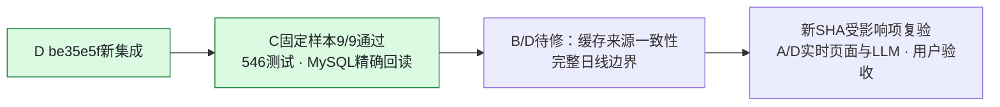

# C 项目进度看板

更新：2026-09-21（A范围/B实施计划协调；最近一次代码复验为09-18的be35e5f）。正式分支`feature/v2-c-backtest-params`；PR #10唯一最终集成，PR #12/#13/#14保留来源与审阅。

**C当前结论：`be35e5febe1acebce32ea9eb495affd6bd730875` + `c-delivery-20260917`固定批次9/9通过；运行时混源缓存、写入一致性和完整日线边界未通过，整体V2仍Draft。A三处哈希文案已确认关闭。**

| 事项 | 当前结论 |
|---|---|
| C核心/固定数据包 | ✅ 12文件未变、六文件SHA-256一致 |
| 新SHA回归 | ✅ 546 tests、compileall；离线AI隔离7项通过 |
| 固定窗口九组 | ✅ direct、POST、新连接MySQL GET完整值/类型/哈希/订单/三曲线一致；每曲线283点 |
| 真实V1→v8/中断恢复 | ✅ MySQL8.0.31独立库通过，原应用库未改 |
| 腾讯change_pct单位 | ✅ 合成探针100→101=0.01、首行null、裁剪前派生 |
| 缓存混源/成功来源原子性 | ❌ 离线复现混合行整体标腾讯、写来源失败仍保留新行情；B/D待修 |
| 盘中完整日线边界 | ❌ 当前仍计入今天，合成未完成bar未过滤；C口径已确认待实现 |
| A三处输入哈希文案 | ✅ PR #13头8615d86独立核对；此遗留项关闭 |
| A新增视觉范围 | D在Issue #15§7已明确不纳入本轮；截至09-21未见新决定，按已集成范围准备页面验收 |
| 实时/真实LLM/浏览器 | ⏳ D有Provider直连证据，C未代签；新SHA完整链路待A/B/D |
| B正式复审 | ⏳ 先前APPROVED只绑定85b7617，新头待复审 |
| B契约更正及实施归属 | ✅ c7790c2文档已核对，B侧过期措辞关闭；⏳ D集成同步及明确实施者，三个代码缺口未修 |
| 整体验收 | ⏳ PR #10保持Draft，修复后按新SHA复验；用户最终验收未完成 |

[本轮C复验报告](C_V2_BE35_RUNTIME_REVIEW_20260918.md) · [机器可读结论](evidence/c-be35-20260918/summary.json) · [前轮85b7617报告](C_V2_FINAL_QUANT_ACCEPTANCE_85B7617_20260917.md)

09-20协调：已确认B最新回复和c7790c2仅改契约文档；D仍be35e5f/Draft。本轮不重复测试、不改算法。建议D指定B实施后端收尾，D集成新SHA后C复验；详见 [B契约确认及协调记录](C_V2_B_C779_COORDINATION_20260920.md)。

以下为保留的历史协调记录，其中SHA/状态以当时范围为准，当前状态以上表为准。

### 2026-09-21：新通知与可执行分工

- 已读取 [B实施计划5754169716](https://github.com/27ye/ai-quant-platform/pull/10#issuecomment-5754169716) 与 [A范围询问5754154999](https://github.com/27ye/ai-quant-platform/issues/11#issuecomment-5754154999)。D仍be35e5f、B仍c7790c2、A仍8615d86；没有新代码交付，本轮不重复测试。
- C认可B的实施清单与现有契约一致；当前缺D确认单一实施者。建议由B完成三个后端缺口，D保留已有Provider修复并负责集成；若D已在实现，B转为复审/补回归，避免同一文件重复开发。C不代D指派、不修改B/D代码。
- 对A，[D在Issue #15§7](https://github.com/27ye/ai-quant-platform/issues/15) 已明确“新视觉改动不纳入本轮V2”；未见更新决定前，C按此准备验收，不把A新视觉分支作为当前量化验收前置条件。A可先按现有集成范围准备页面验收记录，后端收尾形成新最终SHA后，再在该树关闭Mock执行正式复验；已有阶段结果只绑定其被测SHA。
- 若D决定纳入A新改动，请同时列出具体提交/范围并公布新组合SHA；C核对实际差异、哈希字段及受影响接口并执行最终固定包九组，A验证页面。旧签字不自动覆盖新SHA，不因讨论范围再次修改C算法或重导冻结包。
- C复验启动条件：实施方提供完整提交SHA和回归证据，D集成并公布组合SHA及纳入范围。三处运行时缺口与整体V2仍未通过；前轮固定包签字保持原范围。[本轮只读协调证据](evidence/c-coordination-20260921/status.json)。

### B正式评审状态补记

已核对 [B APPROVED评审](https://github.com/27ye/ai-quant-platform/pull/10#pullrequestreview-5232794359)，其针对85b7617的数据集成/日历修复通过，C固定包签字已另发。B提出三项非阻塞维护建议：刷新快照前会话不能有未提交写入；锁仅进程内有效，扩展多worker需另行设计；逐股锁保留不回收属于明确维护选择。本轮记录这些边界，不修改他人代码，不重跑未变的SHA，不取消实时门禁。[状态证据](evidence/c-final85-20260917/B-review-status.json)。

### 2026-09-18 协调更新

- B在 [5711192178](https://github.com/27ye/ai-quant-platform/pull/10#issuecomment-5711192178) 再次确认C文档提交及哈希/工具/日历复验声明，APPROVED结论不变。
- A在 [5712132283](https://github.com/27ye/ai-quant-platform/issues/11#issuecomment-5712132283) 发布PR #13新头 `17b0ea31754e6644e5048a63c8b74db51d73901c`，新增两个前端提交。C静态核对：详情页标签/注释已正确、字段路径不变；`frontend/src/types/api.ts:354,391`仍有两处“C自身结果的哈希”旧注释，请A同步为输入快照SHA-256。此为非阻塞文档残留，D85b7617已有正确说明；正常三方合并不必然覆盖D修复，合入后核对最终树即可。C未代做A的视觉/浏览器验收。
- D在 [5712402584](https://github.com/27ye/ai-quant-platform/issues/11#issuecomment-5712402584) 指派B排查三股运行时K线，明确不得直接把腾讯交付包改作运行时来源。C保持固定批次验收口径；若后续运行时来源或规范化规则变化，应明确来源/精度/缺失字段/失败语义并绑定新版本复验，历史快照不回填。
- 当前PR #10仍 `85b7617149fbff67189e52f6527c9921ff09d388` 且Draft，B仍540a00f；C已签字的代码与固定包未变，**本轮不重复测试、不新增算法**。新A分支尚未进入被测D头；D合入并公布新SHA后再决定受影响复验，不直接沿用旧签字批准新版本。

### Issue #15：运行时腾讯qfq兜底的C表态

2026-09-18已读D提案与B两条执行回复：零改动补热仍失败，现等待C混源契约确认。C同意失败后腾讯qfq兜底方向，约束见 [C运行时来源契约](C_V2_RUNTIME_FALLBACK_CONTRACT_20260918.md)：原签字只绑定旧SHA/固定包；缺失amount/turnover可为null；跨源价格/change_pct可能改变评分；一次计算保持来源与复权连续性；actual source必须贯穿缓存/AI快照；新SHA需复验。发现现有change_pct归一化会除100、AI来源仍返回包装器akshare，已提醒B/D实现时处理。

本轮只完成C定向探针与协调，不实现Provider、不把实时门禁改绿。D决定实施者；B/D给新SHA和实时证据后C再验受影响项。A新视觉按Issue #15声明不纳入本轮V2。当前85b7617固定批次签字保持有效，整体PR仍Draft。

### Issue #15：已答复B的两项待定口径（2026-09-18）

C接受本轮方案A（整段同源刷新，暂不要求v9），并同意完整日线按最近已完成交易日检查；要求先验证再原子发布行情及成功来源，不残留未记录旧行，缓存缺9月17日仍不能判完整。详见 [C缓存与日期口径确认](C_V2_RUNTIME_CACHE_DECISIONS_20260918.md)。B的a7cab6c仅更新契约文档，D仍85b7617/Draft，兜底代码尚未交付。本轮只做源代码/远端状态复核与文档协调，没有新运行时测试结果。下一步由D确认实施者、B/D提供新集成SHA和证据，C按清单复验；原固定包签字不扩展。

## C 后续同步约定

按 2026-09-16 用户的协作要求执行，适用于 C 的后续工作：

1. 每个可审阅的小阶段完成后，在**同一轮工作中**更新本页的事项、负责人、状态、SHA、证据和下一步。
2. 有 C 代码/测试改动时，完成相应检查后提交并推送 `feature/v2-c-backtest-params`；只有复验/协调进展时，也提交 C 的进度文档与可共享证据，不能只保留在本机或聊天中。
3. 推送后核对本地 HEAD、远端分支与 PR #12 head SHA 一致；更新 PR 说明，在相关 Issue 留一条简明进度入口。失败或尚未验证的事项明确标注，不写成“已通过”。
4. PR 说明展示当前结论，历史报告保留原 SHA 与当时结果；新发现单独列项，已关闭项不反复列为待修。
5. 只提交 C 负责的文件及 C 验收记录；A/B 修复由对应成员提交，D 负责集成。推送进度不等于合并 PR，也不将其他成员的代码复制到 C 正式分支。
6. 若推送失败，明确报告“仅本地、尚未同步”和具体原因；修复后再次核对远端。可共享证据排除密钥、连接串、个人绝对路径和临时数据库标识。

本页随实际工作更新，不是后台自动监控。组员查看本页或 PR #12，即可了解 C 最近一次已核实的进度。
