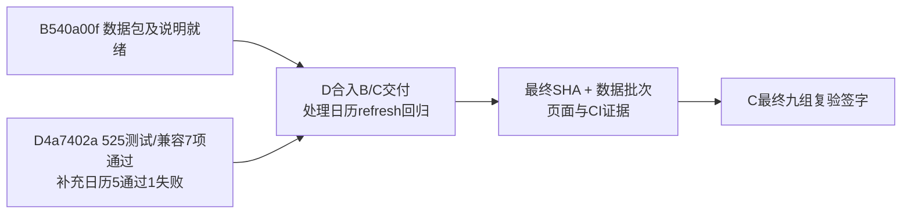

# C 项目进度看板

更新：2026-09-17，D4a7402a冷启动修复候选复核。正式分支`feature/v2-c-backtest-params`；[PR #10](https://github.com/27ye/ai-quant-platform/pull/10)唯一最终集成，[PR #12](https://github.com/27ye/ai-quant-platform/pull/12)保留C来源/审阅。

**当前：D4a7402a既有525项测试及C/AI7项通过；补充日历检查5通过、1失败（静态注入refresh回归）。B540a00f文字更正关闭，D仍待合入8个B提交和C新批次验收工具；最终签字未完成。**

| 事项 | 负责人 | 状态与证据 |
|---|---|---|
| C核心 | C | ✅ 12文件逐字节匹配92df017，无算法改动 |
| D4a7402a既有回归 | C复核 | ✅ 525 tests、compileall、离线C/AI7项通过 |
| 日历并发与刷新 | D | 🟠 C新增确定性探针5通过1失败：静态trade_dates注入后refresh会TypeError；未证明默认实时路径受影响 |
| B数据及文档 | B/C | ✅ B540a00f跨字段校验/完整frame说明已修正；不重复导出相同包 |
| B交付合入 | D | ⏳ 当前4a7402a仍缺8个B提交，完整合入B540a00f |
| C验收工具 | D | ⏳ 纳入b2c372e文件名模板支持或明确外部工具SHA |
| 候选三股九组 | C | ✅ 前轮Dcc57482+腾讯包direct/POST/真实MySQL GET保持原范围，不改签至4a7402a |
| B迁移证据 | B/C | ✅ 前轮B74c 369 tests/35项MySQL PASS保持原范围 |
| 页面/真实数据与LLM | A/D | ⏳ D新增实时API/浏览器记录由D负责；C本轮仅离线验证 |
| 哈希标签 | A/D | 🟠 A PR13 d7ba01c合入时保持“C输入快照哈希” |
| 远程CI | D | ⏳ 本轮查询0 check-run/0 status，尚无通过证据 |
| 最终量化结论 | C | ⏳ 最终SHA及批次确定后复验 |

- [最新D冷启动复核](C_V2_D4A_COLDSTART_REVIEW_20260917.md) / [证据摘要](evidence/c-d4a7402-20260917/summary.json)
- [前轮B集成缺口与关闭记录](C_V2_B821_INTEGRATION_REVIEW_20260917.md) / [原候选九组证据](C_V2_B_TENCENT_REVIEW_20260917.md)
- [最终验收清单](C_V2_FINAL_ACCEPTANCE_READY_20260917.md)
- D：`4a7402a35ec1a42a3a6964d9f351395d19315188`；B：`540a00f604044bd046cd3935f4df9d018063b44b`。测试按被测版本记录，不相加。

## C 后续同步约定

按 2026-09-16 用户的协作要求执行，适用于 C 的后续工作：

1. 每个可审阅的小阶段完成后，在**同一轮工作中**更新本页的事项、负责人、状态、SHA、证据和下一步。
2. 有 C 代码/测试改动时，完成相应检查后提交并推送 `feature/v2-c-backtest-params`；只有复验/协调进展时，也提交 C 的进度文档与可共享证据，不能只保留在本机或聊天中。
3. 推送后核对本地 HEAD、远端分支与 PR #12 head SHA 一致；更新 PR 说明，在相关 Issue 留一条简明进度入口。失败或尚未验证的事项明确标注，不写成“已通过”。
4. PR 说明展示当前结论，历史报告保留原 SHA 与当时结果；新发现单独列项，已关闭项不反复列为待修。
5. 只提交 C 负责的文件及 C 验收记录；A/B 修复由对应成员提交，D 负责集成。推送进度不等于合并 PR，也不将其他成员的代码复制到 C 正式分支。
6. 若推送失败，明确报告“仅本地、尚未同步”和具体原因；修复后再次核对远端。可共享证据排除密钥、连接串、个人绝对路径和临时数据库标识。

本页随实际工作更新，不是后台自动监控。组员查看本页或 PR #12，即可了解 C 最近一次已核实的进度。
