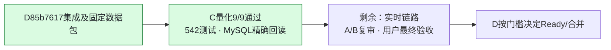

# C 项目进度看板

更新：2026-09-17，C固定批次验收已签字。正式分支`feature/v2-c-backtest-params`；PR #10为唯一最终集成，PR #12/#13/#14保留来源与审阅。

**C结论：`85b7617149fbff67189e52f6527c9921ff09d388` + `c-delivery-20260917`，三股×三参数9/9通过。V2整体仍为Draft，实时链路与A/B复审、用户最终验收未完成。**

| 事项 | 当前结论 |
|---|---|
| A/B/C来源历史与数据交付 | ✅ 已进入D85b7617；六文件hash通过，新批次工具存在 |
| C量化核心 | ✅ 12文件与92df017相同，算法未改 |
| 完整回归 | ✅ C独立542 tests、compileall通过 |
| 固定窗口九组 | ✅ direct、POST、重建engine/session的MySQL GET完整值/类型一致；3曲线各283点 |
| 离线与API哈希 | ✅ data_mode明确统一为dataframe后，九组完整对象精确一致 |
| 历史零重算/AI隔离 | ✅ MySQL历史GET禁止服务解析；另C/D离线兼容7项通过 |
| 真实V1→v8/中断恢复 | ✅ 本机独立MySQL8.0.31通过，旧列/精确结果文本及重复迁移版本时间保全 |
| 静态日历refresh回归 | ✅ 6项定向探针全过，关闭原问题 |
| C输入快照哈希标签 | ✅ D源码已修正；A继续页面验收 |
| C最终固定批次签字 | ✅ 绑定85b7617与c-delivery-20260917，不等于整体V2通过 |
| 实时K线/实时AI | ⏳ D报告当前502/50001，恢复后同SHA复验 |
| A/B复审与用户最终验收 | ⏳ 不由C代签；PR继续Draft，不转Ready、不合并 |

[完整C验收结论](C_V2_FINAL_QUANT_ACCEPTANCE_85B7617_20260917.md) · [证据摘要](evidence/c-final85-20260917/summary.json) · [原D冷启动复核](C_V2_D4A_COLDSTART_REVIEW_20260917.md)

已纳入D两条回复5710957724、5710993739；两者是同一SHA，无需因追加说明重跑同样测试。后续代码/数据变化须按新版本复验；C本轮证据提交可外链引用，无需为合入验收文字反复冻结代码。

## C 后续同步约定

按 2026-09-16 用户的协作要求执行，适用于 C 的后续工作：

1. 每个可审阅的小阶段完成后，在**同一轮工作中**更新本页的事项、负责人、状态、SHA、证据和下一步。
2. 有 C 代码/测试改动时，完成相应检查后提交并推送 `feature/v2-c-backtest-params`；只有复验/协调进展时，也提交 C 的进度文档与可共享证据，不能只保留在本机或聊天中。
3. 推送后核对本地 HEAD、远端分支与 PR #12 head SHA 一致；更新 PR 说明，在相关 Issue 留一条简明进度入口。失败或尚未验证的事项明确标注，不写成“已通过”。
4. PR 说明展示当前结论，历史报告保留原 SHA 与当时结果；新发现单独列项，已关闭项不反复列为待修。
5. 只提交 C 负责的文件及 C 验收记录；A/B 修复由对应成员提交，D 负责集成。推送进度不等于合并 PR，也不将其他成员的代码复制到 C 正式分支。
6. 若推送失败，明确报告“仅本地、尚未同步”和具体原因；修复后再次核对远端。可共享证据排除密钥、连接串、个人绝对路径和临时数据库标识。

本页随实际工作更新，不是后台自动监控。组员查看本页或 PR #12，即可了解 C 最近一次已核实的进度。
