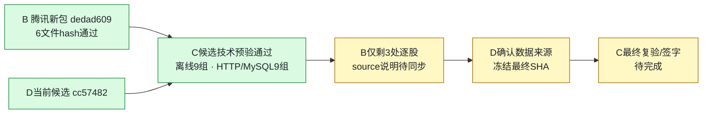

# C 项目进度看板

更新：2026-09-17，新腾讯包复核后。正式分支：`feature/v2-c-backtest-params`；[PR #10](https://github.com/27ye/ai-quant-platform/pull/10)为唯一最终集成，[PR #12](https://github.com/27ye/ai-quant-platform/pull/12)保留C来源/审阅。

**当前：B腾讯新包已交付，C三股九组离线及D cc57482候选的HTTP/MySQL技术预验通过。B溯源与迁移补证已通过，精度说明仅剩逐股source三处残留；待D确认腾讯来源并给最终SHA，C再最终签字。**

| 事项 | 负责人 | 最新状态 / 证据 |
|---|---|---|
| C量化核心 | C | ✅ 保持92df017，算法未改；验收脚本b2c372e支持显式新批次文件名，21项测试通过 |
| B新包与测试 | B，C复核 | ✅ B74c本轮369 tests；6数据文件不变，原包内一致性与九组结论保持原范围 |
| 600519的9/15差异 | B/C | ✅ 新包raw/normalized为1272.75/13762；旧包仍保留原差异证据 |
| V1真实表结构→v8 | B/C | ✅ D候选前轮通过；本轮B74c强化脚本在独立MySQL8.0.31上35项PASS |
| 新包三股九组 | C | ✅ 离线回放与候选HTTP/真实MySQL完整对象/类型精确一致，每组283点；不是最终签字 |
| 腾讯/东财一致性文字 | B | 🟠 顶层/脚本/README已更正，仅manifest的stocks[0..2].source仍有旧句 |
| manifest导出代码溯源 | B，C复核 | ✅ 已补base HEAD、dirty状态、生成脚本指纹与发布提交；C核对实际blob一致 |
| 来源采用与最终SHA | D | ⏳ 当前仍cc57482；确认腾讯作为最终数据并验包/集成 |
| 真实页面、AI、CI | A/D | ⏳ 按PR #10关口收尾；C本轮不代签 |
| 最终C结论 | C | ⏳ 等元信息修正与D最终版本，按[验收清单](C_V2_FINAL_ACCEPTANCE_READY_20260917.md)复验 |

- [最新B74c更正复核](C_V2_B74C_CORRECTION_REVIEW_20260917.md) / [本轮证据](evidence/c-b74c-20260917/summary.json)
- [前轮B新包处理报告](C_V2_B_TENCENT_REVIEW_20260917.md) / [新证据摘要](evidence/c-tencent-20260917/summary.json)
- [D cc57482前轮523 tests及阶段检查](C_V2_D_PLAN_ALIGNMENT_20260916.md) / [原B9a1与A定向复核](C_V2_FOLLOWUP_REVIEW_20260916.md)
- 当前D完整SHA：`cc574827c6c08d2336336a48d9f7a09e9582c60a`；新包完整SHA：`dedad60977511aae8237fc4bb84e7a5321490df1`。测试数按各自版本记录，不相加。

## C 后续同步约定

按 2026-09-16 用户的协作要求执行，适用于 C 的后续工作：

1. 每个可审阅的小阶段完成后，在**同一轮工作中**更新本页的事项、负责人、状态、SHA、证据和下一步。
2. 有 C 代码/测试改动时，完成相应检查后提交并推送 `feature/v2-c-backtest-params`；只有复验/协调进展时，也提交 C 的进度文档与可共享证据，不能只保留在本机或聊天中。
3. 推送后核对本地 HEAD、远端分支与 PR #12 head SHA 一致；更新 PR 说明，在相关 Issue 留一条简明进度入口。失败或尚未验证的事项明确标注，不写成“已通过”。
4. PR 说明展示当前结论，历史报告保留原 SHA 与当时结果；新发现单独列项，已关闭项不反复列为待修。
5. 只提交 C 负责的文件及 C 验收记录；A/B 修复由对应成员提交，D 负责集成。推送进度不等于合并 PR，也不将其他成员的代码复制到 C 正式分支。
6. 若推送失败，明确报告“仅本地、尚未同步”和具体原因；修复后再次核对远端。可共享证据排除密钥、连接串、个人绝对路径和临时数据库标识。

本页随实际工作更新，不是后台自动监控。组员查看本页或 PR #12，即可了解 C 最近一次已核实的进度。
