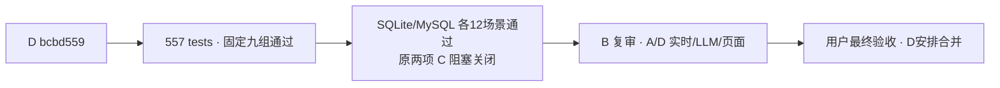

# C 项目进度看板

更新：2026-09-22。正式分支 `feature/v2-c-backtest-params`；PR #10 唯一集成入口，PR #12 保留 C 来源与验收证据。

**当前组合 `bcbd559acb67d3435fe7a840f34ad73bbe35bbad` + `c-delivery-20260917`：C 九组通过；原两处运行时阻塞关闭。整体 V2 仍待实时、真实 LLM、页面与最终用户验收。**

| 事项 | 当前结果 |
|---|---|
| C 核心/固定包 | ✅ 未改算法，六份输入哈希一致 |
| 全量回归 | ✅ 557 tests、compileall、7 项离线 AI 隔离 |
| 固定三股×三参数 | ✅ 9/9；direct / ASGI POST / 新连接 MySQL GET 完整值与类型一致 |
| 原子回滚/迁移 | ✅ MySQL 8.0.31 独立库；V1→v8、中断恢复、旧数据保全 |
| 旧盘中尾行 | ✅ 原缺陷关闭，完成日上限贯穿 union/发布/返回 |
| 日历无法证明 union | ✅ 保守拒绝，旧成功快照保留；中间/末端缺日反例也通过 |
| 空 LLM 历史读取 | ✅ 实际 ASGI/MySQL；历史200、缺失404/40006、缺配置生成50005 |
| B 复审与替代分支 | ✅ B 在 5769722115 公开复审通过 D fe8c0b4/c30f799，明确 cb2cfeb 作废、勿合；C 的反例保留为历史证据 |
| 整体 V2 | ⏳ 真实行情/LLM/关闭 Mock 页面与用户验收不在 C 本轮通过范围；PR #10 仍 Draft |

[当前签字与 B 对比](C_V2_BCBD559_ACCEPTANCE_20260922.md) · [机器可读结论](evidence/c-bcbd559-20260922/summary.json) · [f465ee3 阶段记录](C_V2_F465EE3_REVIEW_20260922.md) · [119a10c 原复现](C_V2_119A10C_REVIEW_20260922.md)

### 2026-09-22：B/C 复核已齐（代码未变）

- 已读 [D 的最终 SHA 请求](https://github.com/27ye/ai-quant-platform/issues/15#issuecomment-5769698954) 与 [B 的最新复审](https://github.com/27ye/ai-quant-platform/issues/15#issuecomment-5769722115)。D 仍 bcbd559、C 52d2b7b 证据已公开。本轮只更新协调记录，不重复运行未变代码的测试。
- B 自报的 559 是 D 原树 557 加 B 两条额外回归；C 独立执行仍记录原树 557，不能混写成原树自带 559。B 的 GitHub 文字复审通过，不等同于本轮另查到正式 APPROVED 事件。
- B 提议增加历史无 LLM 的显式检查：C 已有实际 ASGI/MySQL 空配置、禁用生成依赖探针及公开证据。它目前是验收脚本，不声称已成为 D 的 pytest 常驻用例；D 可后续纳入维护性回归，不新增本轮阻塞。
- C 确认未知 union 覆盖返回 50001 并保留旧快照是有意的完整性取舍；不能为提高成功率而放宽。它与“已知需要某交易日但上游尚未提供”的触发原因不同，文档应分别说明，均不虚报完整数据。
- 按 D 原分工，B/C 当前范围已完成，A 可对当前组合进行页面复验；D 继续外部行情、真实 LLM/重启回读和关 Mock 流程，并同步 PR #10 检查清单。C 不修改 B/D 文档或删除 B 分支，不把整体 V2 标为完成。

[本轮协调状态](evidence/c-bcbd559-20260922/coordination-0857.json)。

以下历史协调状态不覆盖上表；旧签字保持各自 SHA 范围。

### 2026-09-21：新通知与可执行分工

- 已读取 [B实施计划5754169716](https://github.com/27ye/ai-quant-platform/pull/10#issuecomment-5754169716) 与 [A范围询问5754154999](https://github.com/27ye/ai-quant-platform/issues/11#issuecomment-5754154999)。D仍be35e5f、B仍c7790c2、A仍8615d86；没有新代码交付，本轮不重复测试。
- C认可B的实施清单与现有契约一致；当前缺D确认单一实施者。建议由B完成三个后端缺口，D保留已有Provider修复并负责集成；若D已在实现，B转为复审/补回归，避免同一文件重复开发。C不代D指派、不修改B/D代码。
- 对A，[D在Issue #15§7](https://github.com/27ye/ai-quant-platform/issues/15) 已明确“新视觉改动不纳入本轮V2”；未见更新决定前，C按此准备验收，不把A新视觉分支作为当前量化验收前置条件。A可先按现有集成范围准备页面验收记录，后端收尾形成新最终SHA后，再在该树关闭Mock执行正式复验；已有阶段结果只绑定其被测SHA。
- 若D决定纳入A新改动，请同时列出具体提交/范围并公布新组合SHA；C核对实际差异、哈希字段及受影响接口并执行最终固定包九组，A验证页面。旧签字不自动覆盖新SHA，不因讨论范围再次修改C算法或重导冻结包。
- C复验启动条件：实施方提供完整提交SHA和回归证据，D集成并公布组合SHA及纳入范围。三处运行时缺口与整体V2仍未通过；前轮固定包签字保持原范围。[本轮只读协调证据](evidence/c-coordination-20260921/status.json)。

### B正式评审状态补记

已核对 [B APPROVED评审](https://github.com/27ye/ai-quant-platform/pull/10#pullrequestreview-5232794359)，其针对85b7617的数据集成/日历修复通过，C固定包签字已另发。B提出三项非阻塞维护建议：刷新快照前会话不能有未提交写入；锁仅进程内有效，扩展多worker需另行设计；逐股锁保留不回收属于明确维护选择。本轮记录这些边界，不修改他人代码，不重跑未变的SHA，不取消实时门禁。[状态证据](evidence/c-final85-20260917/B-review-status.json)。

### 2026-09-18 协调更新

- B在 [5711192178](https://github.com/27ye/ai-quant-platform/pull/10#issuecomment-5711192178) 再次确认C文档提交及哈希/工具/日历复验声明，APPROVED结论不变。
- A在 [5712132283](https://github.com/27ye/ai-quant-platform/issues/11#issuecomment-5712132283) 发布PR #13新头 `17b0ea31754e6644e5048a63c8b74db51d73901c`，新增两个前端提交。C静态核对：详情页标签/注释已正确、字段路径不变；`frontend/src/types/api.ts:354,391`仍有两处“C自身结果的哈希”旧注释，请A同步为输入快照SHA-256。此为非阻塞文档残留，D85b7617已有正确说明；正常三方合并不必然覆盖D修复，合入后核对最终树即可。C未代做A的视觉/浏览器验收。
- D在 [5712402584](https://github.com/27ye/ai-quant-platform/issues/11#issuecomment-5712402584) 指派B排查三股运行时K线，明确不得直接把腾讯交付包改作运行时来源。C保持固定批次验收口径；若后续运行时来源或规范化规则变化，应明确来源/精度/缺失字段/失败语义并绑定新版本复验，历史快照不回填。
- 当前PR #10仍 `85b7617149fbff67189e52f6527c9921ff09d388` 且Draft，B仍540a00f；C已签字的代码与固定包未变，**本轮不重复测试、不新增算法**。新A分支尚未进入被测D头；D合入并公布新SHA后再决定受影响复验，不直接沿用旧签字批准新版本。

### Issue #15：运行时腾讯qfq兜底的C表态

2026-09-18已读D提案与B两条执行回复：零改动补热仍失败，现等待C混源契约确认。C同意失败后腾讯qfq兜底方向，约束见 [C运行时来源契约](C_V2_RUNTIME_FALLBACK_CONTRACT_20260918.md)：原签字只绑定旧SHA/固定包；缺失amount/turnover可为null；跨源价格/change_pct可能改变评分；一次计算保持来源与复权连续性；actual source必须贯穿缓存/AI快照；新SHA需复验。发现现有change_pct归一化会除100、AI来源仍返回包装器akshare，已提醒B/D实现时处理。

本轮只完成C定向探针与协调，不实现Provider、不把实时门禁改绿。D决定实施者；B/D给新SHA和实时证据后C再验受影响项。A新视觉按Issue #15声明不纳入本轮V2。当前85b7617固定批次签字保持有效，整体PR仍Draft。

### Issue #15：已答复B的两项待定口径（2026-09-18）

C接受本轮方案A（整段同源刷新，暂不要求v9），并同意完整日线按最近已完成交易日检查；要求先验证再原子发布行情及成功来源，不残留未记录旧行，缓存缺9月17日仍不能判完整。详见 [C缓存与日期口径确认](C_V2_RUNTIME_CACHE_DECISIONS_20260918.md)。B的a7cab6c仅更新契约文档，D仍85b7617/Draft，兜底代码尚未交付。本轮只做源代码/远端状态复核与文档协调，没有新运行时测试结果。下一步由D确认实施者、B/D提供新集成SHA和证据，C按清单复验；原固定包签字不扩展。

## C 后续同步约定

按 2026-09-16 用户的协作要求执行，适用于 C 的后续工作：

1. 每个可审阅的小阶段完成后，在**同一轮工作中**更新本页的事项、负责人、状态、SHA、证据和下一步。
2. 有 C 代码/测试改动时，完成相应检查后提交并推送 `feature/v2-c-backtest-params`；只有复验/协调进展时，也提交 C 的进度文档与可共享证据，不能只保留在本机或聊天中。
3. 推送后核对本地 HEAD、远端分支与 PR #12 head SHA 一致；更新 PR 说明，在相关 Issue 留一条简明进度入口。失败或尚未验证的事项明确标注，不写成“已通过”。
4. PR 说明展示当前结论，历史报告保留原 SHA 与当时结果；新发现单独列项，已关闭项不反复列为待修。
5. 只提交 C 负责的文件及 C 验收记录；A/B 修复由对应成员提交，D 负责集成。推送进度不等于合并 PR，也不将其他成员的代码复制到 C 正式分支。
6. 若推送失败，明确报告“仅本地、尚未同步”和具体原因；修复后再次核对远端。可共享证据排除密钥、连接串、个人绝对路径和临时数据库标识。

本页随实际工作更新，不是后台自动监控。组员查看本页或 PR #12，即可了解 C 最近一次已核实的进度。
