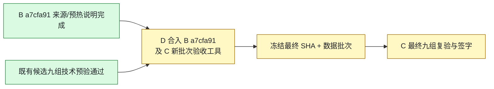

# C 项目进度看板

更新：2026-09-17，B a7cfa91 预热说明关闭 / D b480014 复核。正式分支 `feature/v2-c-backtest-params`；[PR #10](https://github.com/27ye/ai-quant-platform/pull/10) 为唯一最终集成，[PR #12](https://github.com/27ye/ai-quant-platform/pull/12) 保留 C 来源/审阅。

**当前：B 来源与预热说明待办均已关闭，代码和六份数据文件不变；D 待完整合入 B a7cfa91（此前六项及本次文档更正）和 C 新批次验收工具。按 B 转达的 D 腾讯采用决定推进，等待集成与最终 SHA，C 再复验签字。**

| 事项 | 负责人 | 最新状态 / 证据 |
|---|---|---|
| C 核心与工具 | C | ✅ 核心92df017未改；b2c372e新批次工具此前21项测试通过 |
| B 元信息/六数据文件 | B/C | ✅ B821三处source已修正；六文件hash与原交付一致 |
| B 测试及真实迁移 | B/C | ✅ 此前B74c的369 tests / 35项MySQL PASS保持原范围；本轮文档变化未重复测试 |
| 候选三股九组 | C | ✅ 此前D cc57482 + 新包direct/POST/重建连接GET通过，每组283点；未给新D头改签 |
| B 交付合入 | D | ⏳ D b480014未更新；完整合入B a7cfa91，含此前六项及本次文档更正 |
| C 验收工具集成 | D | ⏳ D脚本尚无--filename-template；需集成b2c372e或明确外部工具SHA |
| 来源决定与最终SHA | D | ⏳ 按B转达的已采用腾讯推进，请最终说明记录来源决定并公布40位SHA |
| 交接文档预热规则 | B | ✅ a7cfa91已修正：V2按long，数据包≥120独立；本轮仅文档，不重跑测试 |
| 页面哈希标签 | A/D | 🟠 PR13 d7ba01c仍写“C结果哈希”；保持“C输入快照哈希” |
| 页面/真实AI/CI | A/D | ⏳ 由对应成员收尾，C本轮不代签 |
| 最终量化结论 | C | ⏳ 最终SHA + 批次就绪后复验 |

- [B a7cfa91关闭证据](evidence/c-b821-20260917/B-a7cfa91-closure.json)；其余最终验收待办保持原范围。
- [B821 集成复核及后续更正](C_V2_B821_INTEGRATION_REVIEW_20260917.md) / [证据](evidence/c-b821-20260917/summary.json)
- [B74c测试/迁移证据](C_V2_B74C_CORRECTION_REVIEW_20260917.md) / [腾讯包候选九组证据](C_V2_B_TENCENT_REVIEW_20260917.md)
- [最终验收清单](C_V2_FINAL_ACCEPTANCE_READY_20260917.md)
- D 当前完整 SHA：`b4800149eeaa19037e665e3e40821462a6eabae6`；B：`a7cfa916ddb57483c02dac9138561afd53192e2e`。测试数量按各自被测版本记录，不相加。

## C 后续同步约定

按 2026-09-16 用户的协作要求执行，适用于 C 的后续工作：

1. 每个可审阅的小阶段完成后，在**同一轮工作中**更新本页的事项、负责人、状态、SHA、证据和下一步。
2. 有 C 代码/测试改动时，完成相应检查后提交并推送 `feature/v2-c-backtest-params`；只有复验/协调进展时，也提交 C 的进度文档与可共享证据，不能只保留在本机或聊天中。
3. 推送后核对本地 HEAD、远端分支与 PR #12 head SHA 一致；更新 PR 说明，在相关 Issue 留一条简明进度入口。失败或尚未验证的事项明确标注，不写成“已通过”。
4. PR 说明展示当前结论，历史报告保留原 SHA 与当时结果；新发现单独列项，已关闭项不反复列为待修。
5. 只提交 C 负责的文件及 C 验收记录；A/B 修复由对应成员提交，D 负责集成。推送进度不等于合并 PR，也不将其他成员的代码复制到 C 正式分支。
6. 若推送失败，明确报告“仅本地、尚未同步”和具体原因；修复后再次核对远端。可共享证据排除密钥、连接串、个人绝对路径和临时数据库标识。

本页随实际工作更新，不是后台自动监控。组员查看本页或 PR #12，即可了解 C 最近一次已核实的进度。
